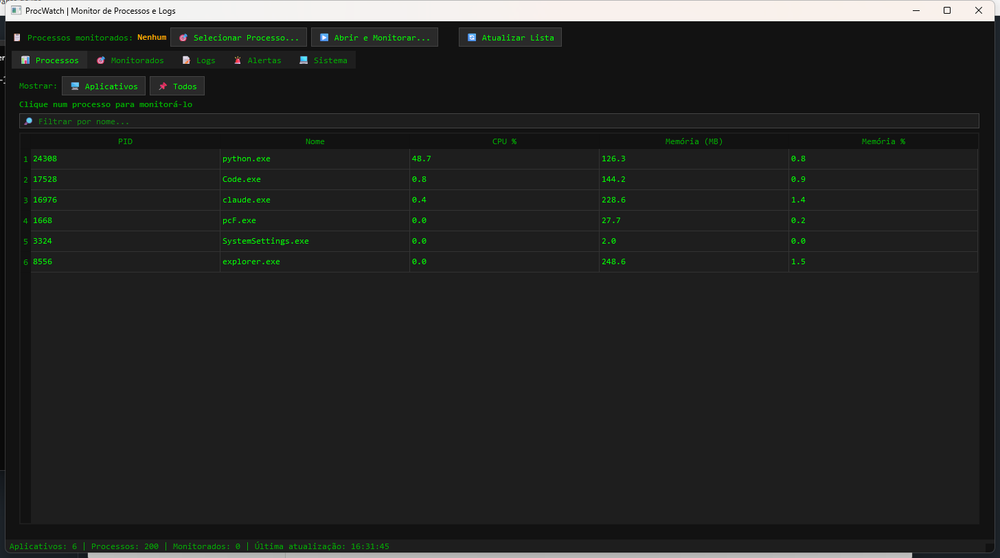
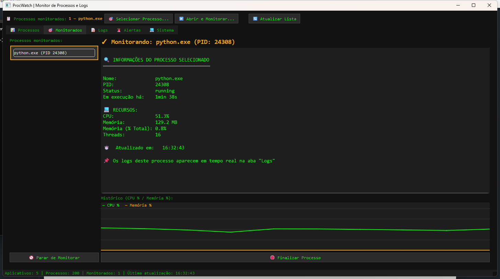
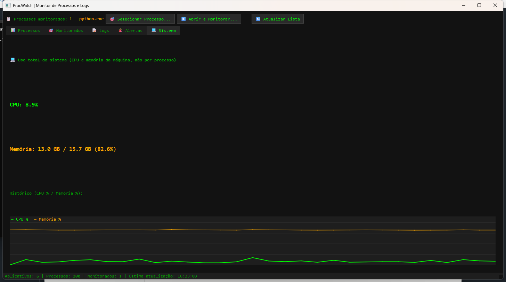
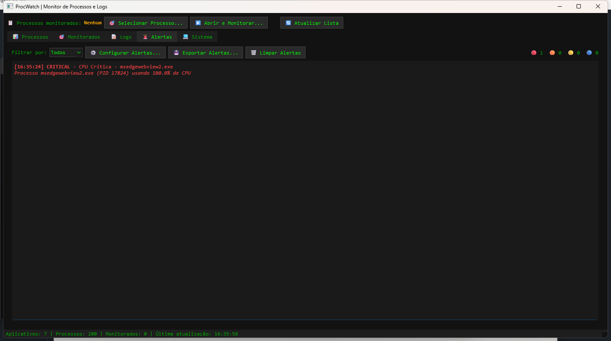

# ProcWatch

Monitor de processos, logs e alertas para Windows, com interface em PyQt6.

## Funcionalidades

- Monitoramento de **vários processos simultaneamente**, com um seletor de processo no
  estilo "Process List" do Cheat Engine (agrupando instâncias repetidas do mesmo
  executável) e separação entre "Aplicativos" (com janela) e processos de fundo.
- Gráfico de histórico (CPU % / Memória %) por processo monitorado.
- Descoberta e acompanhamento em tempo real dos arquivos de log e/ou stdout/stderr
  (para processos lançados pelo próprio ProcWatch) dos processos monitorados, com logs
  combinados numa única aba, prefixados por processo.
- Motor de alertas com thresholds configuráveis (CPU/memória crítica e de aviso, CPU
  sustentada, vazamento de memória, processos zumbis) e palavras-chave de detecção de
  erro customizáveis pelo usuário, tudo persistido entre execuções.
- Ícone na bandeja do sistema com notificações nativas para alertas críticos - fechar a
  janela minimiza para a bandeja e o monitoramento continua em segundo plano.
- Exportação de alertas (CSV) e de logs filtrados (texto).
- Finalização de processo diretamente pela interface.
- Leitura do Visualizador de Eventos do Windows (Application/System).

## Capturas de tela

| Processos | Processo monitorado |
|---|---|
|  |  |

| Sistema | Alertas |
|---|---|
|  |  |

## Download

Não quer rodar do código-fonte? Baixe o executável pronto (Windows, não precisa de
Python instalado) na [página de releases](https://github.com/RafaelSilvaWork/procwatch/releases/latest).

## Requisitos

- Windows (usa `pywin32`/`win32evtlog` para o Visualizador de Eventos)
- Python 3.10+

## Instalação

```bash
python -m venv .venv
.venv\Scripts\activate
pip install -r requirements.txt
```

## Uso

```bash
python desktop/main.py
```

Configurações (thresholds de alerta e geometria da janela) são salvas automaticamente
em `procwatch.ini`, na raiz do projeto. Logs da própria aplicação (erros internos, não
os logs monitorados) ficam em `logs/procwatch.log`, com rotação automática.

## Estrutura do projeto

```
backend/            Lógica de monitoramento, alertas e leitura de logs (sem UI)
  models.py            Dataclasses compartilhadas (ProcessSnapshot, AlertEvent, ...)
  process_monitor.py    Coleta periódica de processos via psutil
  alert_engine.py       Thresholds, supressão e emissão de alertas
  app.py                Descoberta e tail dos arquivos de log de um processo
  file_tail.py           Leitura incremental de um arquivo (estilo tail -f)
  os_logs.py              Leitura do Visualizador de Eventos do Windows
  logging_config.py        Configuração central de logging

desktop/             Interface gráfica (PyQt6)
  main.py                Janela principal
  process_list_dialog.py  Seletor de processo (estilo Cheat Engine)
  alert_settings_dialog.py Diálogo de configuração de thresholds e palavras-chave
  app_settings.py           Persistência de preferências (QSettings)
  history_chart.py           Gráfico leve de histórico (QPainter, sem dependências)
  theme.py                   Folha de estilo centralizada

tests/               Testes automatizados (unittest, sem dependências extras)
```

## Testes

```bash
python -m unittest discover -s tests -v
```

## Empacotando um executável

```bash
pip install -r requirements-dev.txt
pyinstaller --name ProcWatch --onefile --noconsole --icon desktop/resources/icon.ico --add-data "desktop/resources;desktop/resources" desktop/main.py
```
